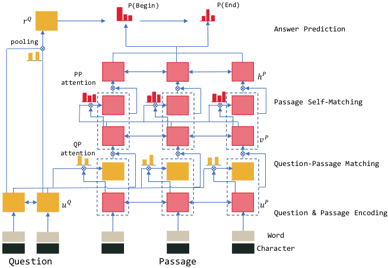

## R-NET in Pytorch
Implementation of R-NET (as decsribed in the paper by Microsoft Research Asia) in Pytorch

### Dataset and Preprocessing

The training and dev sets for SQUAD 2.0 can be downloaded for training and dev evaluation. SQUAD test set is not available publicly. A model can be submitted for evaluation on the test set and the results shared publicly on the leaderboard (if it makes it there!)

The dataset is a json file containing, among other metadata, - passages, questions, associated answer texts, answer start (char) positions, answer length and a flag saying whether the question is answerable from the given passage text.

The dataset has to be carefully transformed before being used for training. Since the dataset does not have token positions of answers in text (only char positions), careful testing must be done to ensure correspondence between token start and end positions with that of original char start and end positions, as without it, the network will train on wrong answers.

Another thing to note is that, the json file does not provide passage, question and answer triplets. These have to be extracted by parsing the json. Also, a pre-trained word-embedding and char-embedding is needed to transfer words to vectors. I use GLOVE but any state-of-the-art embedding - ELMO, BERT etc. can be used. However, the network has many complex bi-directional layers and the size of embedding will also affect how much time it takes to train a batch. 

[Image Source](https://raw.githubusercontent.com/NLPLearn/R-net/master/screenshots/architecture.png?raw=true)
